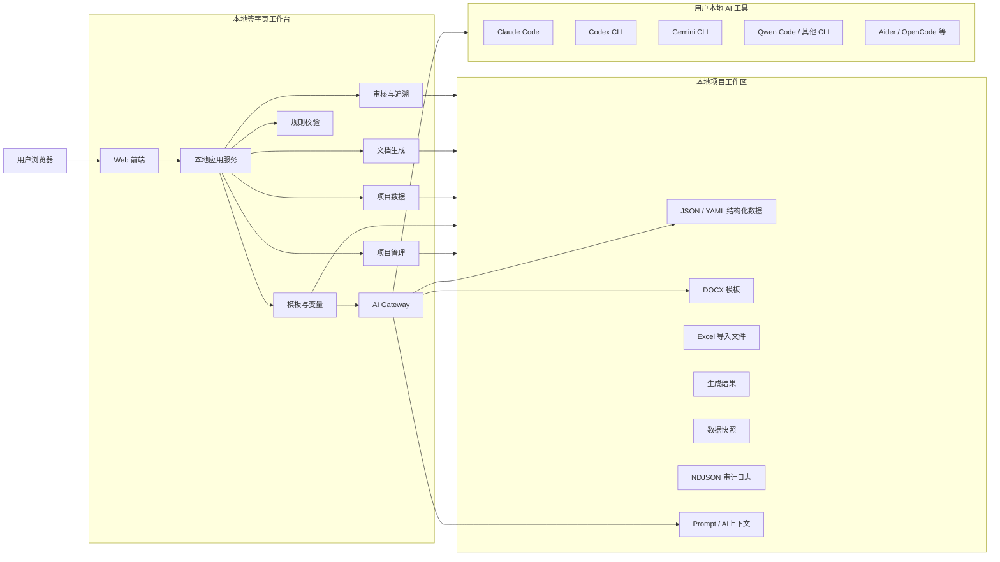
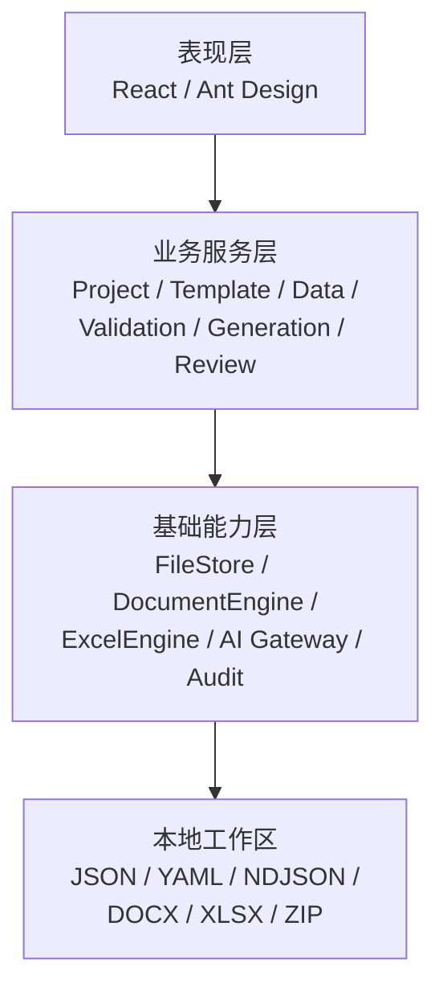
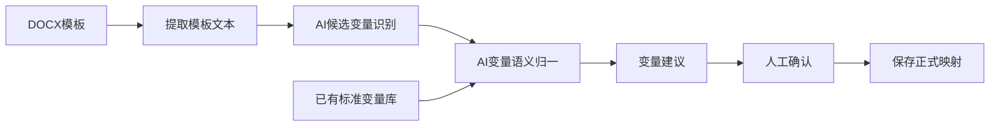
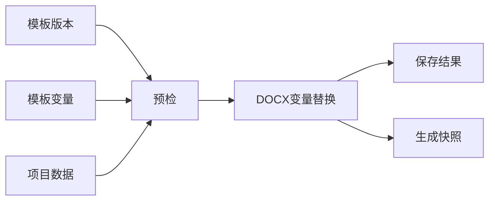

# 签字页项目 MVP 技术架构设计

## 1. 技术目标

本 MVP 的技术实现优先验证以下完整业务闭环：

> **创建项目 → 准备模板 → AI识别及归一变量 → 导入/维护项目数据 → 数据预检 → 批量生成签字页 → 异常定位与局部重试 → 审核 → 批量导出 → 结果追溯**

技术设计遵循四项原则：

1. **轻量化**：单机、本地运行，不引入微服务、消息队列、工作流引擎等非必要基础设施。
2. **文件即数据**：MVP原则上不依赖数据库，以 JSON / YAML / NDJSON / DOCX / XLSX 等本地文件完成持久化。
3. **可渐进实施**：各能力按阶段开发，每阶段均可独立运行、测试和验收，方便 AI 编程工具逐步实现和调试。
4. **AI可替换**：业务系统不直接绑定某一个模型，通过本地 AI CLI Adapter 统一调用用户已安装的 AI 工具。

---

# 2. 总体技术架构

建议采用：

> **本地 Web 应用 + 单一本地服务进程 + 文件系统存储 + AI CLI 子进程**

避免前后端、AI服务、数据库分别部署。



---

# 3. 推荐技术栈

## 3.1 总体选择

推荐统一使用 **TypeScript**。

| 层级 | 推荐方案 | 原因 |
|---|---|---|
| 前端 | React + Vite | 开发快，AI生成和修改代码稳定 |
| UI | Ant Design | ToB后台界面成熟，减少自定义组件开发 |
| 本地服务 | Node.js + TypeScript | 与前端统一语言，同时方便文件、CLI、DOCX处理 |
| API | Express / Fastify | 只需轻量 REST API |
| 数据 | JSON / YAML / NDJSON | 可直接查看、修改、备份，无需数据库 |
| Excel | SheetJS/xlsx | 满足读取、字段映射、导入 |
| DOCX | docxtemplater + pizzip 等成熟库 | 实现变量占位与批量生成 |
| ZIP | archiver 等 | 批量结果打包 |
| AI调用 | Node child_process | 直接调用本机已安装 CLI |
| 自动测试 | Vitest | 与 TypeScript 技术栈统一 |

MVP 不建议引入：

- PostgreSQL / MySQL
- Redis
- Kafka / RabbitMQ
- Elasticsearch
- Docker集群
- BPM工作流引擎
- 向量数据库

这些都不是当前产品价值验证的必要条件。

---

# 4. 应用分层

系统内部建议保持四层。



核心原则：

> **页面不能直接读写文件，所有数据操作统一经过 Service + FileStore。**

这样以后即使需要把 JSON 换成 SQLite 或正式数据库，也不会重写业务逻辑。

---

# 5. 核心功能模块

## 5.1 Project Service

负责：

- 项目创建/编辑
- 项目状态
- 项目模板关联
- 历史项目复制
- 项目参与方
- 项目级基础信息

对应当前方案中：

> 项目是模板、参与方、项目数据及生成结果的统一业务载体。

---

## 5.2 Template Service

负责：

- DOCX导入
- 模板基础信息
- 模板版本
- 模板组
- 模板变量绑定
- 调用 AI 识别候选变量
- AI变量归一
- 人工确认结果

其中：

> **AI分析结果不得直接更新正式标准变量。**

必须：

```text
AI建议
 ↓
用户确认
 ↓
正式保存
```

---

# 6. AI能力架构

这里是整个技术架构中最值得重点设计的部分。

AI并不是一个固定 API，而设计为：

> **AI Gateway → CLI Adapter → 用户本地AI工具**

---

## 6.1 为什么使用本地 CLI

本方案不在应用中直接维护：

- OpenAI API Key
- Anthropic API Key
- Gemini API Key
- 国内模型 API Key

而复用用户已经登录、授权和配置完成的 AI CLI。

例如系统发现用户已经安装：

```text
claude
codex
gemini
qwen
aider
opencode
...
```

则直接调用。

带来的好处是：

- 不重复管理模型账号和密钥；
- 用户可以自行选择AI工具；
- 国内外模型均可接入；
- 产品不依赖单一AI厂商；
- 后续扩展新的CLI不影响业务层。

---

# 7. AI CLI Gateway

设计统一接口：

```text
AI Gateway
   │
   ├── Tool Scanner
   ├── Tool Registry
   ├── Prompt Builder
   ├── Context Builder
   ├── CLI Adapter
   ├── Response Parser
   └── Fallback Manager
```

---

## 7.1 Tool Scanner

应用启动时扫描本机可执行程序。

候选工具采用配置文件维护，例如：

```yaml
tools:
  - id: claude
    commands:
      - claude

  - id: codex
    commands:
      - codex

  - id: gemini
    commands:
      - gemini

  - id: qwen
    commands:
      - qwen

  - id: aider
    commands:
      - aider

  - id: opencode
    commands:
      - opencode
```

这里不应假设某个工具一定存在。

系统实际执行类似：

```text
which <command>
<command> --version
```

成功以后注册为：

```text
AVAILABLE
```

否则：

```text
NOT_INSTALLED
```

CLI名称和调用参数独立配置，以实际安装版本为准。

---

# 8. AI Adapter

每种AI工具实现统一抽象：

```text
AIAdapter

detect()
getVersion()
isAvailable()

execute(request)

cancel()

parseResponse()
```

业务层只调用：

```text
aiGateway.execute(task)
```

而不知道背后实际是：

> Claude / Codex / Gemini / Qwen / Aider / OpenCode。

---

# 9. AI调用优先级

建议系统支持两种方式：

### 自动模式

用户设定优先级：

```text
1 Claude
2 Codex
3 Gemini
4 Qwen
```

第一个可用工具执行。

失败：

```text
Claude
 ↓ timeout
Codex
 ↓
成功
```

### 手动模式

界面显示本地已检测到：

```text
✓ Claude Code
✓ Codex CLI
✓ Gemini CLI
× Qwen Code

当前AI：Codex CLI
```

允许用户自己选择。

**MVP更建议以手动选择为主，自动Fallback作为增强能力。**

这样AI行为更加可解释。

---

# 10. AI上下文设计

这一点非常关键。

AI不能只收到：

> “帮我提取变量。”

而应该读取当前项目定义的上下文。

建议 AI 工作目录：

```text
workspace/
└── ai/
    ├── prompts/
    │   ├── system.md
    │   ├── extract_variables.md
    │   └── normalize_variables.md
    │
    ├── context/
    │   ├── variable_schema.json
    │   └── business_rules.md
    │
    └── runs/
```

一次模板识别，Context Builder组合：

```text
系统规则
+
变量识别Prompt
+
当前模板文本
+
系统已有标准变量
+
变量Schema说明
```

再提交给本地AI工具。

---

# 11. AI模板变量识别流程

与你当前方案中的AI设计保持一致：AI首先从上传模板识别变量，再参考系统已有标准变量给出归一建议。

建议拆成两个逻辑阶段。



---

## 11.1 AI输出必须结构化

例如：

```json
{
  "variables": [
    {
      "source_text": "法定代表人",
      "suggested_variable_id": "legal_representative_name",
      "suggested_variable_name": "法定代表人姓名",
      "match_type": "existing",
      "confidence": 0.96,
      "reason": "与系统已有变量语义一致"
    },
    {
      "source_text": "联系人微信号",
      "suggested_variable_id": null,
      "suggested_variable_name": "联系人微信号",
      "match_type": "new",
      "confidence": 0.84,
      "reason": "现有变量库中无对应变量"
    }
  ]
}
```

系统不要依赖AI直接生成最终数据库操作。

---

# 12. AI边界

AI职责：

> **识别 + 理解 + 推荐**

规则程序职责：

> **校验 + 状态控制 + 文件生成**

用户职责：

> **确认关键业务判断**

因此：

| 行为 | AI是否允许 |
|---|---:|
| 识别候选变量 | 是 |
| 推荐标准变量 | 是 |
| 推荐变量合并 | 是 |
| 建议新增变量 | 是 |
| 推荐Excel字段映射 | 可选 |
| 自动新增正式变量 | 否 |
| 自动修改项目数据 | 否 |
| 绕过校验 | 否 |
| 自动审核通过 | 否 |

---

# 13. 本地数据架构

不建议把“没有数据库”理解成“所有内容放一个 JSON”。

推荐：

> **按业务实体和项目分目录保存。**

整体结构：

```text
workspace/
│
├── system/
│   ├── settings.json
│   ├── users.json
│   ├── roles.json
│   └── variables.json
│
├── templates/
│   ├── groups.json
│   │
│   └── tpl_xxx/
│       ├── template.json
│       │
│       └── versions/
│           └── v1/
│               ├── metadata.json
│               ├── source.docx
│               └── variables.json
│
├── projects/
│   └── project_xxx/
│       ├── project.json
│       ├── participants.json
│       ├── data.json
│       ├── templates.json
│       │
│       ├── imports/
│       ├── tasks/
│       ├── results/
│       ├── snapshots/
│       └── reviews/
│
├── audit/
│   └── audit.ndjson
│
└── ai/
    ├── prompts/
    ├── context/
    └── runs/
```

---

# 14. 为什么使用这种结构

例如：

```text
projects/project_001/
```

本身就是一个完整项目的数据包。

因此：

### 复制项目

可以通过复制：

```text
participants.json
data.json
```

实现。

### 项目备份

直接复制：

```text
project_001/
```

即可。

### Demo重置

直接替换目录。

### 排查错误

可以直接打开 JSON 查看数据。

对于一个 MVP，明显比建立数据库、迁移脚本、ORM、Seeder 等更轻。

---

# 15. 核心数据文件

## project.json

```json
{
  "project_id": "P001",
  "project_name": "XX股份IPO",
  "project_type": "IPO",
  "status": "DATA_PREPARING",
  "owner_user_id": "U001",
  "created_at": "...",
  "updated_at": "..."
}
```

---

## participants.json

```json
[
  {
    "participant_id": "PT001",
    "participant_type": "company",
    "participant_name": "A证券公司",
    "role_code": "sponsor",
    "status": "active"
  }
]
```

---

## data.json

```json
[
  {
    "data_id": "D001",
    "participant_id": "PT001",
    "variable_id": "company_name",
    "value": "A证券股份有限公司",
    "source_type": "excel",
    "status": "VALID"
  }
]
```

---

# 16. 审计日志

审计数据不要不断改写巨大 JSON。

建议使用：

> **append-only NDJSON**

例如：

```text
audit/audit.ndjson
```

每行：

```json
{"time":"...","user":"U001","action":"PROJECT_DATA_UPDATE","resource":"D001"}
{"time":"...","user":"U002","action":"GENERATION_START","resource":"T001"}
{"time":"...","user":"U003","action":"REVIEW_APPROVE","resource":"R001"}
```

优点：

- 只追加；
- 不需要读取整个文件再保存；
- 损坏概率低；
- 天然按照时间排序；
- 后续很容易导入数据库。

---

# 17. 文件写入安全

虽然不使用数据库，也不能直接粗暴覆盖 JSON。

统一 FileStore 使用：

```text
读取
 ↓
校验
 ↓
写入 xxx.tmp
 ↓
fsync
 ↓
rename 替换正式文件
```

利用操作系统的原子 rename 降低写坏数据的风险。

---

# 18. 并发控制

MVP 是本地单用户或演示级多角色切换，不需要复杂分布式锁。

采用：

> **单进程写队列 + 文件级互斥锁**

即可。

例如：

```text
project_001/.lock
```

一个写操作完成后释放。

同一个项目：

> 同一时刻仅允许一个结构化写操作。

读取不锁。

---

# 19. Excel导入架构


字段映射分两级：

### 第一优先：规则匹配

例如：

```text
公司名称 == 公司名称
```

自动匹配。

### 第二优先：人工匹配

用户选择：

```text
Excel：法人姓名
→
标准变量：法定代表人姓名
```

AI映射推荐属于增强功能，而不是 Excel 导入成立的前提。当前产品方案也是将其定义为增强能力。

---

# 20. 数据校验引擎

不使用通用规则引擎。

采用代码级 Validator：

```text
RequiredValidator
TypeValidator
TemplateVariableValidator
ParticipantRoleValidator
```

统一输出：

```json
{
  "valid": false,
  "errors": [
    {
      "code": "MISSING_REQUIRED",
      "participant_id": "PT001",
      "variable_id": "legal_representative",
      "message": "法定代表人不能为空"
    }
  ]
}
```

这样直接支撑：

> 异常列表 → 定位 → 修改 → 重新校验。

---

# 21. DOCX生成引擎

生成过程：



原则：

> **生成使用具体模板版本，而不是“当前模板”。**

保证后续模板升级后，历史结果仍然可以追溯。

---

# 22. 生成任务

不引入消息队列。

采用：

> **应用内部 Task Runner**

即可。

```text
GenerationTask
    ↓
Result #1
Result #2
Result #3
...
```

一次批量任务：

```json
{
  "task_id": "TASK001",
  "status": "RUNNING",
  "total_count": 100,
  "success_count": 62,
  "fail_count": 3
}
```

执行时每生成一份：

> 更新对应 Result 文件。

---

# 23. 局部失败

这是必须保证的核心技术能力。

不要：

```text
生成第37份失败
→ 整个任务异常退出
```

而是：

```text
1 SUCCESS
2 SUCCESS
3 FAILED
4 SUCCESS
...
```

最后：

```text
任务 = PARTIAL_FAILED
```

用户修复：

```text
Result #3
```

后：

> 只重新执行 #3。

这与当前产品方案中“失败原因定位、异常修正、失败项重新生成”的 MVP 设计一致。

---

# 24. 数据快照

生成文件的同时保存：

```text
results/R001/
├── result.json
├── generated.docx
└── snapshot.json
```

snapshot：

```json
{
  "template_version": "V3",
  "participant_id": "PT001",
  "variables": {
    "company_name": "A证券股份有限公司",
    "legal_representative": "张三"
  }
}
```

这样即使：

> project/data.json

以后变了，历史结果仍然可以完整解释。

---

# 25. 审核

MVP 不建设 Workflow Engine。

只维护：

```text
PENDING
APPROVED
REJECTED
```

审核通过：

```text
result/task
 ↓
review
 ↓
APPROVED
```

驳回后：

> 修改 → 重新生成 → 再次提交。

每一次提交创建新的审核记录，不覆盖历史记录。

---

# 26. 批量导出

审核通过后：

```text
选择生成结果
 ↓
检查状态
 ↓
复制 DOCX
 ↓
ZIP
 ↓
下载
```

目录可采用：

```text
XX项目_签字页_20260902.zip
│
├── 主承销商/
├── 律师事务所/
├── 会计师事务所/
└── 其他参与方/
```

不需要第一阶段实现 PDF 转换。

---

# 27. 系统状态保存与异常恢复

本地系统重启后应能恢复任务。

例如：

```text
task.status = RUNNING
```

应用重新启动时发现：

> 上一次程序已退出，但任务仍标记 RUNNING。

自动转换为：

```text
INTERRUPTED
```

允许用户：

> 继续未完成任务 / 重新执行失败项。

不要依赖内存保存业务状态。

---

# 28. 技术目录建议

后续让 AI 编程时，可以直接按这个目录创建工程：

```text
signature-page/
│
├── apps/
│   ├── web/
│   └── server/
│
├── packages/
│   ├── domain/
│   ├── storage/
│   ├── document-engine/
│   ├── excel-engine/
│   ├── validation/
│   └── ai-gateway/
│
├── workspace/
│   ├── projects/
│   ├── templates/
│   ├── system/
│   ├── audit/
│   └── ai/
│
├── prompts/
│   ├── variable-extraction.md
│   └── variable-normalization.md
│
├── fixtures/
│   ├── sample-project/
│   ├── sample-template/
│   └── sample-excel/
│
└── tests/
```

这里建议保留轻量 monorepo 结构，但：

> **仍然只有一个应用，不是微服务。**

packages 只是代码模块。

---

# 29. 分阶段实施

这一部分对“使用 AI 编程渐进实现”非常重要。

不要直接让 AI：

> “把整个系统做出来。”

建议分 **7阶段**。

---

## Phase 0：项目骨架与数据层

目标：

> 系统先能稳定读写本地数据。

实现：

- React页面骨架
- Node服务
- FileStore
- workspace目录
- JSON Schema / TypeScript 类型
- 原子文件写入
- 基础日志
- Demo数据初始化

验收：

> 创建一个项目，退出应用，再启动，项目仍然存在。

**这一阶段不做AI、不做DOCX、不做Excel。**

---

# Phase 1：项目与模板基础能力

实现：

- 项目列表
- 创建/编辑项目
- 项目状态
- 模板列表
- DOCX上传
- 模板版本
- 标准变量列表
- 项目关联模板

验收：

```text
创建项目
→ 上传模板
→ 建立模板版本
→ 关联到项目
```

核心对象打通。

---

# Phase 2：项目数据与Excel

实现：

- 参与方
- 项目数据
- Excel解析
- 字段映射
- 预览
- 保存
- 手工修改

验收：

```text
上传Excel
→ 映射字段
→ 导入项目数据
→ 页面可查看和修改
```

---

# Phase 3：规则校验

实现：

- 必填校验
- 类型校验
- 模板变量完整性
- 参与方角色校验
- 生成前预检
- 异常列表

验收：

> 故意删除一个必填值，系统必须准确指出参与方 + 变量 + 错误原因。

到这里：

**仍然完全不需要AI。**

---

# Phase 4：DOCX生成闭环

实现：

- 占位符绑定
- 单份生成
- 批量生成
- Generation Task
- Generation Result
- 成功/失败统计
- 数据快照
- 局部重试
- ZIP导出

验收：

> 输入一批合法数据，生成完整DOCX；其中一条数据异常时，其余结果仍生成成功。

至此完成：

> **非AI核心业务闭环。**

这是一个非常重要的里程碑。

---

# Phase 5：AI Gateway

这一阶段才开始接AI。

实现：

- CLI Scanner
- Tool Registry
- Adapter
- CLI运行器
- timeout
- cancel
- stdout/stderr捕获
- 结构化结果解析
- AI运行日志

第一阶段只接：

> **一个CLI**

例如当前开发机器上最稳定的一个。

接口跑通以后，再扩展第二、第三种。

---

# Phase 6：AI变量识别与归一

实现：

```text
DOCX
↓
文本提取
↓
AI提取候选变量
↓
读取 variables.json
↓
AI标准变量匹配
↓
建议：
  使用已有变量
  / 新建变量
↓
用户确认
↓
写入模板变量
```

验收重点不是“AI每次都正确”。

而是：

> **AI错误时用户能够看见、修正，而且不会污染正式变量库。**

这是本项目AI产品化最关键的边界。

---

# Phase 7：审核、审计与Demo完善

最后补：

- 审核通过/驳回
- 审核意见
- 操作日志
- 历史结果
- UI优化
- 工作台
- Demo预置数据
- 异常场景演示

---

# 19. 模块化页面与服务分层落地

最新实现需要避免把所有能力压在一个演示页内。MVP 前端按照本地 ToB 后台系统组织：

```text
顶部栏：当前项目 / 当前角色 / 全局状态
左侧菜单：工作台 / 项目管理 / 模板中心 / 变量管理 / 项目数据 / 生成任务 / 审核交付 / 审计日志
内容区：列表页 + 详情或操作区
```

角色仍然是单账号内直接切换，但角色会影响：

- 左侧可见模块；
- 页面按钮可用性；
- 后端写操作权限；
- 审计日志中的操作者角色。

后端按照以下边界组织：

| 层级 | 职责 |
|---|---|
| Route | HTTP 入参、文件上传、权限校验、响应格式 |
| Service | 项目、模板、变量、数据、校验、生成、审核、AI、审计等业务动作 |
| Store | 分目录文件读写、原子保存、单进程写队列 |
| Domain | 类型、权限矩阵、菜单矩阵、校验规则 |
| AI | CLI 输出解析、结构化结果校验 |

当前接口以模块化 REST API 为主，同时保留少量旧接口兼容演示入口。新增核心接口包括：

```text
GET/POST /api/projects
GET/PATCH /api/projects/:projectId
GET/POST/PATCH /api/variables
GET/POST /api/templates
POST /api/templates/:templateId/versions
POST /api/templates/:templateId/analyze-variables
POST /api/templates/:templateId/confirm-variables
GET/POST/PATCH /api/projects/:projectId/participants
POST /api/projects/:projectId/imports/preview
POST /api/projects/:projectId/imports/confirm
POST /api/projects/:projectId/preflight
GET/POST /api/projects/:projectId/generation-tasks
GET /api/generation-tasks/:taskId
POST /api/results/:resultId/retry
GET/POST /api/reviews
POST /api/reviews/:reviewId/decision
GET /api/exports/:taskId
GET /api/audit
GET /api/ai/tools
GET /api/ai/runs
```

这一层补充的目的不是扩大 MVP 范围，而是让演示更接近产品方案中的真实信息架构：用户可以看到模块、列表、详情、状态和异常，而不是只看到单个流程面板。
