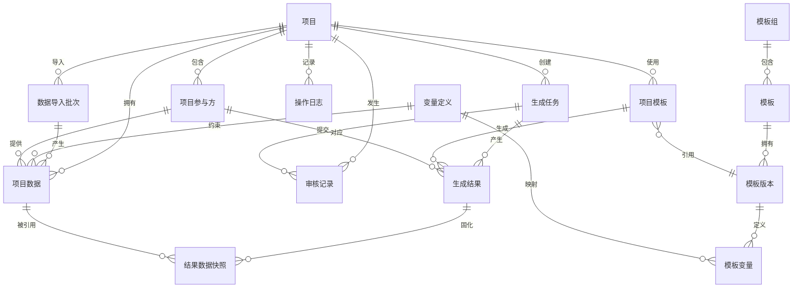
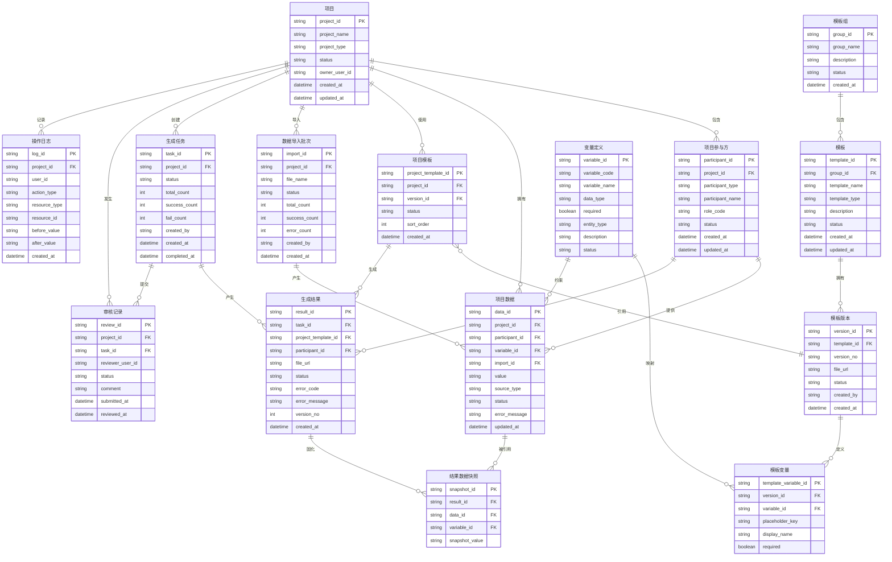
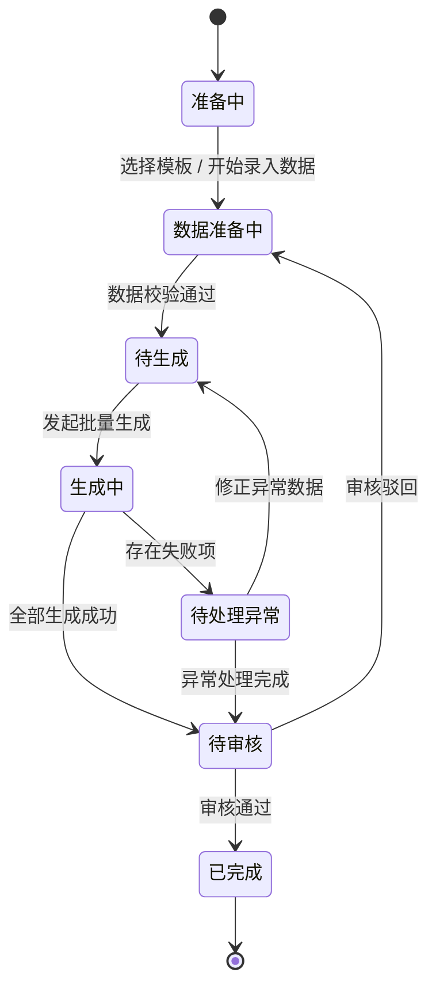
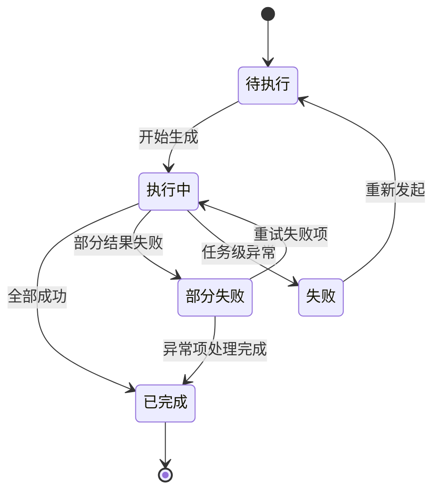
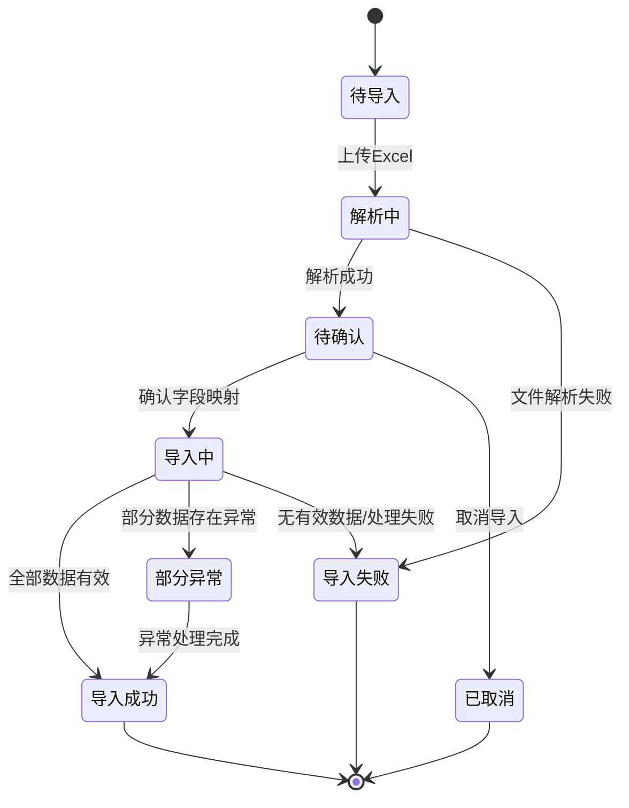

# 签字页项目产品方案报告

# **执行摘要**

由于这并不是一个要真实交付的项目，我会基于考题的要求和自己的理解，重点关注：

- 不再对已有的题目范围做更多的背景和潜在需求调研

- 围绕核心需求痛点，基于 ToB 产品设计体系，展开相关产品工作

- 不追求如 PRD 形式的完整产品方案，可能会缺少关于通用功能、功能细节的描述，重点体现产品设计思路

- AI 能力的结合 / 简易 Demo 的实现

# **现状与产品定义**

## 我理解的需求本质

项目中的模板、参与方、签署角色和项目数据缺乏统一结构化管理，导致签字页生成高度依赖人工复制、核对和协作，需要借助本产品提升协作效率、准确性和可追溯性

## 一句话产品定义

建立一个面向 IPO 项目的“签字页生成与管理工作台”，通过项目级数据、模板和角色的结构化管理，实现批量生成、校验、异常处理和结果追溯。

# **用户与核心场景**

|**用户角色**|**核心任务**|**当前痛点**|**产品响应**|
|---|---|---|---|
|项目负责人 / 项目律师|创建项目、选模板、确认范围、发起生成|启动慢、跨项目难复用、进度和结果不可控|项目工作台、模板组、统一数据源、任务状态|
|助理律师 / 法务专员|批量采集参与方数据、导入 Excel、处理异常|重复录入、容易出错、失败后难定位|批量导入、字段映射、前置校验、局部重试|
|审核人 / 合伙人|检查关键变量和结果，确认是否可进入签署|责任边界模糊、版本难追溯、修改记录不清楚|审核视图、版本信息、数据快照、审计日志|
|模板运营 / 系统管理员|维护模板、变量、版本、权限|模板分散、版本混乱、改动影响范围不透明|模板中心、版本管理、变量 Schema、变更影响分析|

# **产品目标与设计原则**

# **MVP 范围与取舍**

|模块|功能|MVP 实现|范围说明 / 取舍理由|
|---|---|---|---|
|用户与权限|登录 / 注册|否|当前阶段重点验证业务流程，不涉及真实用户接入，采用预置用户即可|
|用户与权限|预置用户与角色|是|预置项目负责人/项目律师、助理律师/法务专员、审核人/合伙人、模板管理员等角色，用于还原不同岗位的业务操作，可直接切换进行演示|
|用户与权限|固定角色功能权限|是|按角色限定可执行操作，满足核心协作边界；暂不提供动态权限配置|
|用户与权限|数据权限|否|MVP 暂以项目内协作为主，项目级、部门级等复杂数据隔离后续结合实际管理模式设计|
|工作台|项目及待处理事项概览|是|汇总进行中项目、数据异常、生成失败、待审核等状态，帮助用户快速定位当前需处理事项|
|工作台|独立任务中心 / 消息中心|否|当前待办可由业务状态自然产生，独立任务与消息体系暂不作为核心验证范围|
|项目管理|项目列表|是|项目是模板、参与方、项目数据及生成结果的统一业务载体|
|项目管理|创建 / 编辑项目|是|维护项目基本信息并作为签字页任务启动入口|
|项目管理|项目状态管理|是|反映数据准备、生成、审核、完成等关键阶段，支撑进度追踪|
|项目管理|项目固定属性|是|保留项目类型、负责人等与当前业务直接相关的基础字段|
|项目管理|自定义属性 / 标签体系|否|属于跨项目精细化管理能力，当前对签字页生成核心闭环贡献有限|
|项目管理|项目关联模板 / 模板组|是|根据项目需要确定本次需生成的签字页范围，是生成任务的重要输入|
|项目管理|历史项目快速复用|是，简化|支持复制历史项目的参与方或基础数据，降低重复录入；暂不建设独立主数据中心|
|项目数据|项目参与方管理|是|对参与方及其签署角色进行结构化管理，是确定“谁需要签什么”的核心基础|
|项目数据|手工新增 / 编辑参与方数据|是|支撑日常补录及异常修正|
|项目数据|Excel 批量导入|是|对应现有批量录入场景，减少人工重复录入，是核心效率提升点|
|项目数据|导入字段映射|是|将外部 Excel 字段映射至系统标准变量，解决不同来源数据结构不一致的问题|
|项目数据|导入预览与确认|是|在正式写入前识别缺失或无法映射的数据，降低错误进入后续流程的概率|
|项目数据|项目数据查看 / 修改|是|支撑生成前检查以及异常发生后的快速修正|
|项目数据|企业 / 人员统一主数据中心|否|属于跨项目长期数据治理能力，待实际复用规模形成后再建设|
|模板管理|模板列表及基础信息维护|是|集中管理签字页模板，解决模板分散的问题|
|模板管理|DOCX 模板导入|是|MVP 聚焦题目提供的核心文档类型，作为签字页生成基础|
|模板管理|AI 识别模板变量|是|自动识别模板中的候选变量，降低人工模板配置成本，是 AI 能力的主要验证场景|
|模板管理|AI 识别结果确认 / 修正|是|AI 结果由用户确认后进入正式模板配置，保证业务结果可控|
|模板管理|模板预览|是|方便用户核对模板内容及变量识别结果|
|模板管理|变量占位符绑定|是|建立模板内容与标准变量之间的对应关系，是数据驱动生成的必要条件|
|模板管理|在线自由编辑 Word 内容|否|当前核心目标是模板化生成而非在线文档编辑，复杂编辑能力不属于 MVP 验证范围|
|模板管理|基础版本管理|是|保存模板版本及当前启用版本，确保项目生成结果可追溯至具体模板|
|模板管理|版本 Diff / 回滚|否|属于模板治理增强能力，基础版本记录已可满足 MVP 追溯需求|
|模板管理|模板变更影响分析|否|更适用于模板规模扩大后的治理场景，当前优先验证生成闭环|
|变量管理|标准变量维护|是|建立统一变量定义，为模板绑定、项目数据映射和生成校验提供统一标准|
|变量管理|变量类型 / 必填属性|是|为数据校验提供基础规则|
|变量管理|复杂计算变量 / 规则引擎|否|当前以直接数据填充为主，复杂派生逻辑并非核心业务前提|
|数据校验|必填字段校验|是|避免关键数据缺失后进入生成流程|
|数据校验|基础数据类型校验|是|提前识别日期、文本等常见格式异常|
|数据校验|模板变量完整性校验|是|识别模板变量无法匹配或缺少数据的问题|
|数据校验|参与方 / 签署角色校验|是|确保参与方与签署角色关系完整，降低漏生成、错生成风险|
|数据校验|生成前预检|是|在正式生成前统一反馈可生成数量及异常项，将问题前置处理|
|数据校验|复杂智能纠错|否|MVP 优先通过明确规则发现问题，自动修改业务数据暂不作为核心能力|
|生成任务|创建批量生成任务|是|将一次批量生成形成独立任务，统一记录范围、进度和结果|
|生成任务|批量生成签字页|是|产品核心价值能力，根据模板、项目数据及参与方关系自动生成签字页|
|生成任务|生成进度|是|支持用户了解批量任务执行状态，避免生成过程不可感知|
|生成任务|成功 / 失败统计|是|明确反馈生成结果，帮助快速定位需要人工介入的范围|
|生成结果|结果列表|是|按参与方、模板等维度查看每份生成结果及状态|
|生成结果|单份预览 / 下载|是|支撑生成结果核验|
|生成结果|批量导出|是|满足生成完成后的实际交付需求|
|生成结果|PDF 等多格式自动转换|否|MVP 先验证签字页正确生成与批量交付，多格式输出作为后续增强能力|
|异常处理|失败项列表|是|集中展示未成功生成的签字页，避免用户重新逐份排查|
|异常处理|失败原因定位|是|明确指出相关参与方、变量及错误原因，解决现有“失败后难定位”的问题|
|异常处理|异常数据直接修正|是|用户可从异常进入对应数据进行修改，缩短问题处理路径|
|异常处理|单条 / 失败项重新生成|是|修正后只重新处理受影响结果，避免整批重复操作|
|异常处理|AI 自动修改异常数据|否|法律业务数据修改需保持明确责任边界，AI 可辅助识别但不直接替代人工确认|
|审核与交付|提交审核|是|将生成结果从操作环节转入确认环节，明确责任边界|
|审核与交付|审核通过 / 驳回|是|支撑最小审核闭环，确保结果经确认后再进入正式交付|
|审核与交付|审核意见|是|对驳回或特殊情况保留必要说明，支撑协作追踪|
|审核与交付|多级审批 / 条件审批|否|MVP 仅验证签字页审核机制，不引入复杂工作流体系|
|审核与交付|在线电子签署|否|当前产品边界聚焦“签字页生成与管理”，实际签署不纳入第一阶段范围|
|版本与追溯|生成结果版本|是|对重新生成后的结果保留版本关系，避免结果覆盖后无法追溯|
|版本与追溯|生成数据快照|是|固化生成当时使用的关键数据，保证后续项目数据变化时仍可还原历史结果|
|版本与追溯|模板版本关联|是|明确每个生成结果使用的模板版本，形成完整生成依据|
|审计|关键操作日志|是|记录数据修改、生成、审核等关键动作，满足基本责任追踪需求|
|审计|完整审计分析平台|否|MVP 保留关键日志即可，更复杂的查询和分析能力后续建设|
|AI 能力|模板变量识别|是|AI 直接降低模板配置的人工作业量，且结果可验证、可人工修正|
|AI 能力|Excel 字段映射推荐|是，增强|当外部字段名称与标准变量不一致时提供映射建议，由用户确认后生效|
|AI 能力|异常原因辅助解释|否，增强|可在后续用于降低异常理解成本，但不影响核心业务闭环成立|
|外部集成|OA / DMS / 邮件等系统集成|否|第一阶段优先验证产品自身业务闭环，外部系统接入待实际落地场景明确后展开|
|外部集成|SSO / 企业通讯录|否|属于正式企业部署所需的基础设施能力，不作为 MVP 业务价值验证内容|

# **核心业务模型**

# **核心业务流程**

# **状态 / 异常 / 权限 / 审计**

## 主要实体状态

**项目状态**

**任务**

**数据导入**

# **AI 能力设计与边界**

我准备让 AI 在需要人工辨别 / 思考的部分发挥作用：

1. AI 自动提取上传模版中的变量

2. AI 自动参考提取的变量、系统中已有的变量给出归一建议

# **核心原型 / Demo**

# **成功指标、假设与风险**

# **Roadmap**

